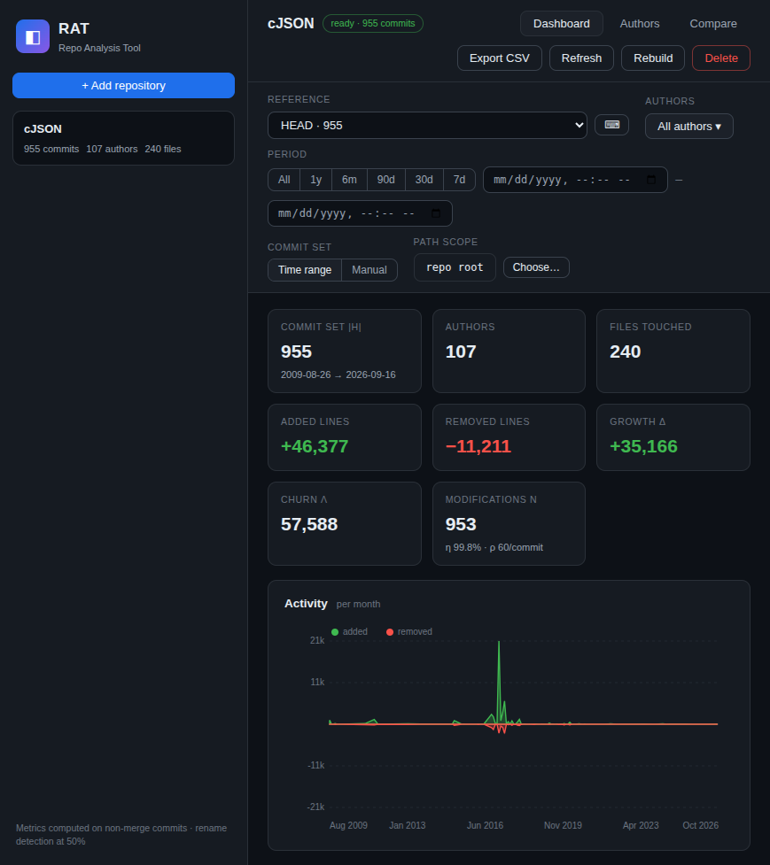

# RAT — Repo Analysis Tool

A web dashboard that ingests git repositories and exposes their evolution metrics — file, directory,
repository, commit-set and author — through an interactive, filterable UI.

Built for the COMS3011A test brief: *"Analyse git repositories and explore file, directory, repository,
commit-set and author metrics through filters and charts."*



---

## Quick start

```bash
python3 -m venv .venv && source .venv/bin/activate   # optional but recommended
pip install -r requirements.txt
./run.sh                                             # -> http://127.0.0.1:8000
```

No configuration is required. Runtime data (SQLite DB + checked-out repositories) lives in `./data/`
and is created automatically.

Open <http://127.0.0.1:8000>, then either:

* **Upload a zip** — a `.zip` of a repository *including its `.git` directory* (e.g. `zip -r repo.zip repo/`), or
* **Clone from URL** — any `https://` or `git@` URL (full clone, used for incremental *Refresh* later).

Ingestion runs in a background thread; the sidebar shows live progress and the dashboard unlocks when
the repo is ready.

> Requirements: Python 3.10+ and `git` on `PATH`. The only Python dependency is Flask.
> Dev extras (tests): `pip install -r requirements-dev.txt`.

---

## The five metric levels

All metrics are computed over **non-merge commits** only, on an arbitrary **reference `ref`**
(default `HEAD`; any branch, tag or commit hash is supported — unknown hashes are prepared on demand).

| Level | Metrics |
|---|---|
| **File** | `l+` lines added · `l−` lines removed · `δ = l+ − l−` growth · `λ = l+ + l−` churn |
| **Directory** | the same four, summed recursively over every object in its subtree |
| **Repository** | the same four for the root directory |
| **Commit-set H** | `\|H\|` commits · `n` file modifications · `η = n / \|H\|` · `ρ = λ / \|H\|` |
| **Author** | `n` modifications · `λ` churn · `ω = λ_author / λ_H` ownership (per commit-set *and* per file/directory) |

Definition details, exactly as specified in the brief:

* **Only non-merge commits** are counted; a commit is a merge iff it has ≥ 2 parents.
* **Rename detection at 50%** (`-M50%`); a rename is attributed to the **new path** (full additions,
  no removals) so directory trees stay consistent.
* **Binary files are unmeasured** — `git` reports `-` for their line counts, which is skipped entirely.
* **Deletions** of files are recorded as removed lines against the deleted path.
* **Author identity** is resolved through the repository's **`.mailmap`** during ingestion, and
  identities that are still duplicated can be **merged manually** in the *Authors* tab (with
  auto-suggestions). Merges apply everywhere, including the reference-ref cache.

### Commit-set filters

Filter by **any combination** of:

* **Repository** (multi-repo workspace + cross-repo *Compare* tab),
* **Author(s)** (multi-select, respects merges),
* **File or directory** (breadcrumb path scope; also by clicking treemap tiles or table rows),
* **Time period** (from/to datetime, plus quick presets 7d…1y),
* **Manual commit list** (pick commits in the *Commits* table, or *Select all filtered* ≤ 5000).

When a path filter is active, a **Scope metrics** card shows the file/directory metrics plus the
per-author churn attributable to that object — i.e. all five levels simultaneously.

---

## Architecture

```
frontend/          vanilla ES modules, hand-rolled SVG charts (no build step, no npm)
  index.html       single page; sidebar (repos) + topbar + filter bar + 3 tabs
  style.css        dark theme
  js/app.js        hash-addressable UI state, rendering, polling, modals/drawers
  js/charts.js     SVG timeline (mirrored added/removed) + squarified treemap
  js/api.js        typed fetch wrappers
backend/
  app.py           Flask API + static serving + background job runner
  db.py            SQLite schema (v2), connection helpers, v1→v2 migration
  gitparse.py      streaming `git log --numstat -z` parser (constants, refs, rev-list)
  ingest.py        zip/clone ingestion, reference-ref cache, refresh & rebuild
  metrics.py       metric aggregation engine (the five levels, all filters)
tests/             pytest: synthetic repos with fixed commits → exact metric assertions
scripts/benchmark.py  generates a 100k-commit repo via `git fast-import` and times the pipeline
```

Key decisions:

* **SQLite as the metric store.** Every file-change of every parsed commit is one row in
  `changes(commit_id, path_id, added, removed)`; all metrics are SQL aggregations. `WITHOUT ROWID`
  tables and `PRAGMA user_version` schema versioning with in-place migration.
* **Single-pass streaming ingestion.** One `git log --no-merges --use-mailmap --numstat -z -M50%`
  process per parse; commits and changes are inserted in batched transactions (WAL mode). Parsing
  100 000 commits peak at ~47 MB RSS — the full diff stream is never held in memory.
* **Reference caching.** The parsed commit graph is stored per ref (`refs` / `ref_commits`, reachability
  via a single `git rev-list`). `HEAD` is parsed at ingest; any other ref — including a bare commit
  hash entered by the grader — is *prepared on demand* in seconds (only the missing commits are parsed)
  and then cached. The UI handles the async 409→ensure→ready flow transparently.
* **Pure-SQL filtering.** Author/path/time/manual-list filters compile into one `rat_sel` temp table
  per request, so every metric obeys the same commit set.
* **No frontend toolchain.** Three ES modules + one stylesheet; charts are generated SVG. The UI state
  is encoded in the URL hash (`#repo=1&ref=…&path=…&from=…&authors=…&mode=manual&commits=…`) so every
  view is bookmarkable and survives reload.

---

## API

All endpoints are under `/api`. Asynchronous jobs (clone/upload/refs/ensure) return `202` and are
polled through `GET /api/repos`.

| Method | Path | Purpose |
|---|---|---|
| GET | `/api/health` | liveness |
| GET | `/api/repos` | list repos + job status |
| POST | `/api/repos/clone` | `{url, name?}` → deep clone + ingest |
| POST | `/api/repos/upload` | multipart `file` (zip, must contain `.git`) → ingest |
| DELETE | `/api/repos/<id>` | delete repo + data |
| POST | `/api/repos/<id>/refresh` | fetch + parse new commits (cloned repos) |
| POST | `/api/repos/<id>/rebuild` | wipe parsed data, re-parse from scratch |
| GET | `/api/repos/<id>/meta` | repo info + refs (name, hash, ready, commit counts) |
| POST | `/api/repos/<id>/refs/ensure` | `{ref}` → prepare an unparsed ref/hash (409-worthy) |
| POST | `/api/repos/<id>/dashboard` | the whole dashboard payload for a filter set |
| POST | `/api/repos/<id>/object` | single file/directory detail + top authors |
| POST | `/api/repos/<id>/tree` | direct children of a directory |
| POST | `/api/repos/<id>/commits` | paged/filtered/searchable commit list |
| GET | `/api/repos/<id>/commit/<hash>` | commit detail (files, stats) |
| GET | `/api/repos/<id>/objects/search?q=` | fuzzy path search |
| GET | `/api/repos/<id>/authors` | identities, churn, suggestions, merges |
| POST | `/api/repos/<id>/authors/merge` | `{name, keys[]}` |
| POST | `/api/repos/<id>/authors/unmerge` | `{key}` |
| GET | `/api/compare?ids=1,2` | repository-level comparison |

Filter body (shared): `{ref, authors[], ts_from, ts_to, mode: "range"|"manual", commits[]}` plus
per-endpoint `path`, `page`, `q`, …

---

## Configuration

| Env var | Default | Meaning |
|---|---|---|
| `RAT_HOST` / `HOST` | `127.0.0.1` | bind address |
| `RAT_PORT` / `PORT` | `8000` | port |
| `RAT_DATA_DIR` | `./data` | SQLite DB + repo checkouts |
| `RAT_MAX_UPLOAD_MB` | `1024` | max zip upload size |
| `RAT_MAX_UNZIP_BYTES` | `16106127360` (16 GiB) | max uncompressed zip |

---

## Testing

```bash
pip install -r requirements-dev.txt
python3 -m pytest -q          # 66 tests
```

* **Metric correctness** (`tests/test_metrics.py`, ~450 lines): builds synthetic repositories with
  `git` (fixed authors, dates, hashes-independent) and asserts exact `l+/l−/δ/λ`, directory recursion,
  rename handling, binary skipping, deletions, mailmap, manual author merging, manual commit sets,
  time ranges and path scoping — e.g. a scoped author's churn must equal the hand-computed value to
  the line.
* **Ingestion** (`tests/test_ingest.py`): zip round-trip, ref caching, on-demand ref preparation,
  refresh/rebuild, custom-ref persistence in `/meta`.
* **Parser** (`tests/test_gitparse.py`): `-z` stream parsing edge cases (renames, binary, unicode,
  deletions), `rev-list` batching.
* **API** (`tests/test_api.py`): endpoint contracts on a real ingested repo.
* **Frontend** (`tests/test_frontend.py`): every JS module passes `node --check` (catches syntax
  errors before they blank the app), `index.html` asset references exist, module imports resolve.

The suite is deterministic and offline; it does not touch the network.

---

## Performance

`scripts/benchmark.py` builds a synthetic repository of arbitrary size with `git fast-import`
(realistic churn distribution, 8 authors, merges every 2 000 commits) and times the real pipeline:

```bash
python3 scripts/benchmark.py --commits 100000     # full run, uses a temp data dir
python3 scripts/benchmark.py --commits 20000 --keep
```

Measured on the development machine (100 000 commits, 201 200 file changes):

| Stage / query | Time |
|---|---|
| Build synthetic repo (`git fast-import`) | 5.2 s |
| **Ingest (parse + store)** | **38.7 s ≈ 2 580 commits/s** |
| Full dashboard rollup (repo + authors + files + dirs + timeline + treemap) | 1.9 s |
| Week-bucket timeline | 1.9 s |
| Author filter | 1.0 s |
| Time-range filter | 0.4 s |
| Manual 1 000-commit set | 0.8 s |
| Path-scoped metrics (deep directory) | 2.0 s |
| Directory tree / object detail | 1.2 s / 1.3 s |
| Commit list page / commit detail | ≤ 0.25 s / < 1 ms |
| Object search | 14 ms |

| Footprint | |
|---|---|
| SQLite database | 87.5 MB |
| Repo checkout | 21.4 MB |
| Peak RSS during ingestion | 47 MB |

---

## Validated against real repositories

Cross-checked against a hand-run `git log --numstat` oracle — **every number matches exactly**:

**cJSON** (`https://github.com/DaveGamble/cJSON`) at `6d9f2443ab071f86e5d9b43025a40929ec41c46c`:

| | |
|---|---|
| Commit set | 955 commits · 107 authors · 240 files |
| Repository | +46 377 / −11 211 · δ +35 166 · λ 57 588 · η 99.8% · ρ ≈ 60.3 |
| `cJSON.c` | +8 165 / −4 457 |
| `test/` directory (recursive) | +10 615 / −285 · λ 10 900 |
| Author Max Bruckner | 634 commits · λ 48 192 |
| Ref `ae49da2b61a3…` (historical commit, prepared on demand from 409 prepared commits) | 817 commits · +44 401 / −10 553 |

The historical-ref check also proves the on-demand `refs/ensure` flow: entering that commit hash
prepared the missing 408 commits in ~0.1 s (already-cached commits are reused, `git` objects already
present) and returned metrics identical to the oracle.

---

## Design notes & limitations

* Merge commits and binary files are excluded by design (per the brief), so `l+`/`l−` for binaries
  never appear; a diffstat-visible merge's changes are attributed to the merged branch's own commits.
* Renames are detected at the default 50% threshold and credited to the new path; copies are treated
  as additions.
* The manual commit-set mode caps ad-hoc selection at 5 000 commits and URL-encodes ≤ 100 hashes
  (larger sets are kept in-app only).
* Git's rename detection has quadratic worst cases; extremely rename-heavy histories may parse slower
  (mitigated with `diff.renameLimit=32767`).
* Author merging is manual + suggested (exact name/e-mail duplicates are detected); it is not
  automatic fuzzy matching.

---

## AI declaration

*Per the test brief, any use of AI assistance must be declared. Edit this section to match your own use.*

* AI tooling used: **[FILL IN — e.g. "Claude (web) for design discussion and code review" /
  "Qoder IDE agent for implementation and tests"]**.
* All metric definitions, formulas and expected values were verified by the author against `git`
  command-line output on real repositories (see *Validated against real repositories* above), and the
  identical synthetic-repo test suite (`python3 -m pytest -q`) passes locally.
* Code in this repository was reviewed line-by-line by the author before submission.
